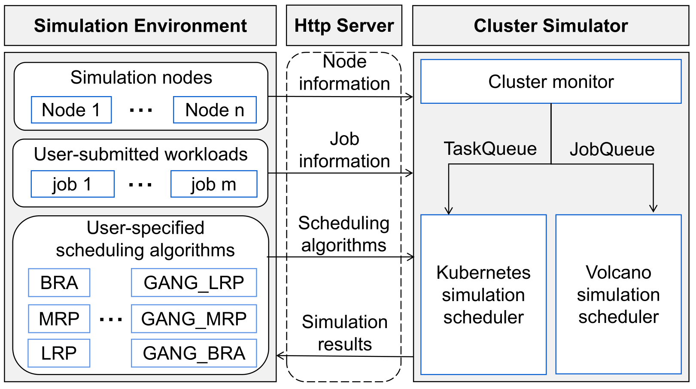
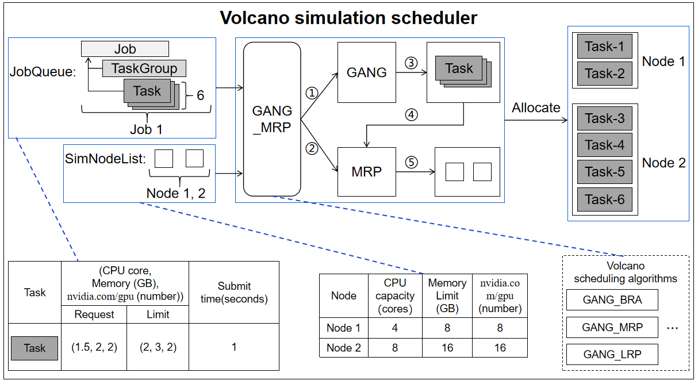

# K8sSim(一个Kubernetes集群调度模拟器)


## 目录
- [K8sSim](#k8ssim)
  - [1. 介绍](#1-介绍)
  - [2. K8sSim总体架构](#2-k8ssim总体架构)
    - [2.1 Kubernetes模拟器](#11-kubernetes模拟器)
      - [2.1.1 k8s-simulator-prop](#111-k8s-simulator-prop)
      - [2.1.2 k8s-benchmark](#112-k8s-benchmark)
      - [2.1.3 部署和使用](#113-部署和使用)
    - [2.2 Volcano模拟器](#12-volcano模拟器)
      - [2.2.1 Volcano_simulator](#121-volcano_simulator)
      - [2.2.2 Submit_volcano_workloads](#122-submit_volcano_workloads)
      - [2.2.3 部署和使用](#123-部署和使用)
  - [3. 联系方式](#2-联系方式)
  
# 1. 介绍
We propose a cluster simulator called K8sSim, a simulation tool for Kubernetes schedulers and its applications in scheduling algorithm optimization. Then we design and implement K8sSim, which incorporates typical Kubernetes and Volcano scheduling algorithms for both generic and AI workloads, and provides an accurate simulation of their scheduling process in real clusters. As a result, K8sSim can not only ensure the accuracy of scheduling results, but also greatly accelerate the scheduling time of different scheduling algorithms in the real cluster. Therefore, our proposed K8sSim can provide a convenient analysis tool and a basis for a series of research works on cluster scheduling optimization.

# 2. K8sSim总体架构

## 2.1 Kubernetes模拟器
该模拟器负责在Kubernetes模拟器中执行通用负载(对于一个通用工作负载来说，作业中的任务是按照时间的先后顺序提交的)


### 2.1.1 k8s-simulator-prop：Kubernetes模拟调度器
* k8s/example: ***模拟调度器的启动程序*** 
  * conf.go: 模拟调度器运行的端口, **e.g. port = ":8002"**
  * create_scheduler.go: 创建一个新的通用调度器，以模仿Kube-Scheduler
  
  ```go

  func buildSchedulers() []scheduler.Scheduler {

	// 1. Create a generic scheduler that mimics a kube-scheduler.
	sched1 := scheduler.NewGenericScheduler( /* preemption enabled */ true)
	sched2 := scheduler.NewGenericScheduler( /* preemption enabled */ true)
	sched3 := scheduler.NewGenericScheduler( /* preemption enabled */ true)
	sched4 := scheduler.NewGenericScheduler( /* preemption enabled */ true)
	sched5 := scheduler.NewGenericScheduler( /* preemption enabled */ true)
	sched6 := scheduler.NewGenericScheduler( /* preemption enabled */ true)
	sched7 := scheduler.NewGenericScheduler( /* preemption enabled */ true)
	sched8 := scheduler.NewGenericScheduler( /* preemption enabled */ true)
	sched9 := scheduler.NewGenericScheduler( /* preemption enabled */ true)
	sched10 := scheduler.NewGenericScheduler( /* preemption enabled */ true)
	sched11 := scheduler.NewGenericScheduler( /* preemption enabled */ true)

	scheds := make([]scheduler.Scheduler, 12, 12)
	scheds[1] = &sched1
	scheds[2] = &sched2
	scheds[3] = &sched3
	scheds[4] = &sched4
	scheds[5] = &sched5
	scheds[6] = &sched6
	scheds[7] = &sched7
	scheds[8] = &sched8
	scheds[9] = &sched9
	scheds[10] = &sched10
	scheds[11] = &sched11

	// 2. Register plugin(s)
	// Predicate
	sched1.AddPredicate("GeneralPredicates", predicates.GeneralPredicates)
	sched2.AddPredicate("GeneralPredicates", predicates.GeneralPredicates)
	sched3.AddPredicate("GeneralPredicates", predicates.GeneralPredicates)
	sched4.AddPredicate("GeneralPredicates", predicates.GeneralPredicates)
	sched5.AddPredicate("GeneralPredicates", predicates.GeneralPredicates)
	sched6.AddPredicate("GeneralPredicates", predicates.GeneralPredicates)
	sched7.AddPredicate("GeneralPredicates", predicates.GeneralPredicates)
	sched8.AddPredicate("GeneralPredicates", predicates.GeneralPredicates)
	sched9.AddPredicate("GeneralPredicates", predicates.GeneralPredicates)
	sched10.AddPredicate("GeneralPredicates", predicates.GeneralPredicates)
	sched11.AddPredicate("GeneralPredicates", predicates.GeneralPredicates)

	sched2.AddPrioritizer(priorities.PriorityConfig{
		Name:   "LeastRequested",
		Map:    priorities.LeastRequestedPriorityMap,
		Reduce: nil,
		Weight: 1,
	})

	sched3.AddPrioritizer(priorities.PriorityConfig{
		Name:   "MostRequested",
		Map:    priorities.MostRequestedPriorityMap,
		Reduce: nil,
		Weight: 1,
	})

	sched4.AddPrioritizer(priorities.PriorityConfig{
		Name:   "BalancedResourceAllocation",
		Map:    priorities.BalancedResourceAllocationMap,
		Reduce: nil,
		Weight: 1,
	})

	sched5.AddPrioritizer(priorities.PriorityConfig{
		Name:   "ResourceLimitsPriority",
		Map:    priorities.ResourceLimitsPriorityMap,
		Reduce: nil,
		Weight: 1,
	})

	sched6.AddPrioritizer(priorities.PriorityConfig{
		Name:   "TaintTolerationPriority",
		Map:    priorities.ComputeTaintTolerationPriorityMap,
		Reduce: nil,
		Weight: 1,
	})

	sched7.AddPrioritizer(priorities.PriorityConfig{
		Name:   "NodeAffinityPriority",
		Map:    priorities.CalculateNodeAffinityPriorityMap,
		Reduce: nil,
		Weight: 1,
	})

	sched8.AddPrioritizer(priorities.PriorityConfig{
		Name:   "NodePreferAvoidPodsPriority",
		Map:    priorities.CalculateNodePreferAvoidPodsPriorityMap,
		Reduce: nil,
		Weight: 1,
	})

	sched9.AddPrioritizer(priorities.PriorityConfig{
		Name:   "ImageLocalityPriority",
		Map:    priorities.ImageLocalityPriorityMap,
		Reduce: nil,
		Weight: 1,
	})

	sched10.AddPrioritizer(priorities.PriorityConfig{
		Name:   "NodeLabelPriority",
		Map:    new(priorities.NodeLabelPrioritizer).CalculateNodeLabelPriorityMap,
		Reduce: nil,
		Weight: 1,
	})

	sched11.AddPrioritizer(priorities.PriorityConfig{
		Name:   "InterPodAffinityPriority",
		Map:    nil,
		Reduce: nil,
		Function: new(priorities.InterPodAffinity).CalculateInterPodAffinityPriority,
		Weight: 1,
	})

	return scheds
  }
  ```

### 2.1.2 k8s-benchmark：通用负载测试的仿真环境
* common/test_workloads: 一些测试所用的通用负载(即用户提交的负载, e.g. ce/ce-bra.yaml)
* common/nodes: 与真实集群中节点资源保持一致的模拟节点配置文件 (即仿真节点, c2e2.yaml)
* common/summarizing: 一些对jobs和pods模拟调度的结果进行格式化的代码，以便于后续分析和使用
* run_sim_workload.py: ***用来提交测试负载和模拟节点配置文件的启动程序*** 
  * workload_dir: 指定本次测试使用负载的文件夹位置
  * sim_node_conf: 指定本次测试使用的仿真节点配置
  * schedulers: 指定本次测试所需对比的多种Kubernetes调度算法的名称 (e.g. bra, lrp, mrp)
  * repeat_times: 指定测试的重复次数
  * sim_base_url: 指定调度模拟器运行的端口(**e.g. 'http://localhost:8002'**)
  * result_dir: 指定模拟结果存放的位置

### 2.1.3 部署和使用
* 软件版本:
  * Linux and Windows
  * Python 3.8
  * Go 1.14.13
* 执行步骤:
  * *1. cd Kubernetes Simulation/k8s-simulator-prop*
  * *2. cd k8s/example*
  * *3. go bulid*
  * *4. example.exe (Windows system); ./example/example port (Linux system)*
  * *5. cd Kubernetes Simulation/k8s-benchmark*
  * *6. python3.8 run_sim_workload.py*

## 2.2 Volcano模拟器
该模拟器负责在Volcano仿真调度器中执行AI工作负载（对于一个AI工作负载来说，作业中的任务通常是以task-group的形式并发执行的）


### 2.2.1 Volcano_simulator：Volcano模拟调度器
* cmd/sim: ***Volcano模拟调度器的启动程序*** 
  * conf.go: 模拟调度器执行的端口, **e.g. var port = ":8006"**
  * pkg/scheduler/scheduler.go: 函数NewScheduler被用来创建一个新的调度器, 函数loadSchedulerConf被用来装载一个新的调度器配置（即应用一个新的volcano调度算法到集群中）
  
  ```go
  
  func NewScheduler(
	config *rest.Config,
	schedulerName string,
	schedulerConf string,
	period time.Duration,
	defaultQueue string,
	nodeSelectors []string,
   ) (*Scheduler, error) {
	var watcher filewatcher.FileWatcher
	if schedulerConf != "" {
		var err error
		path := filepath.Dir(schedulerConf)
		watcher, err = filewatcher.NewFileWatcher(path)
		if err != nil {
			return nil, fmt.Errorf("failed creating filewatcher for %s: %v", schedulerConf, err)
		}
	}

	scheduler := &Scheduler{
		schedulerConf:  schedulerConf,
		fileWatcher:    watcher,
		cache:          schedcache.New(config, schedulerName, defaultQueue, nodeSelectors),
		schedulePeriod: period,
	}

	return scheduler, nil
   }
   ```
   
   ```go
   func (pc *Scheduler) loadSchedulerConf() {
	var err error
	pc.once.Do(func() {
		pc.actions, pc.plugins, pc.configurations, err = unmarshalSchedulerConf(defaultSchedulerConf)
		if err != nil {
			klog.Errorf("unmarshal scheduler config %s failed: %v", defaultSchedulerConf, err)
			panic("invalid default configuration")
		}
	})

	var config string
	if len(pc.schedulerConf) != 0 {
		if config, err = readSchedulerConf(pc.schedulerConf); err != nil {
			klog.Errorf("Failed to read scheduler configuration '%s', using previous configuration: %v",
				pc.schedulerConf, err)
			return
		}
	}

	actions, plugins, configurations, err := unmarshalSchedulerConf(config)
	if err != nil {
		klog.Errorf("scheduler config %s is invalid: %v", config, err)
		return
	}

	pc.mutex.Lock()
	// If it is valid, use the new configuration
	pc.actions = actions
	pc.plugins = plugins
	pc.configurations = configurations
	pc.mutex.Unlock()
   }
   ```
     
### 2.2.2 Submit_volcano_workloads：AI负载测试的仿真环境
* common/workloads: 用来测试的一些AI负载(即用户提交的负载, e.g. AI-workloads/wsl_test_mrp-2.yaml)
* common/nodes: 与真实集群中节点资源保持一致的模拟节点配置文件(即仿真节点，nodes_7-0.yaml)
* SimRun.py: ***用来提交测试负载和模拟节点配置文件的启动程序*** 
  * sim_base_url: 调度模拟器运行的端口(**e.g. 'http://localhost:8006'**)
  * node_file_url: 指定本次测试所用的仿真节点
  * workload_file_url: 指定本次测试负载所在的文件夹位置
  * schedulers: 指定本次测试中需要进行对比的多种Volcano调度算法(e.g. GANG_BRA, GANG_MRP, GANG_LRP)
  * pods_result_url: 指定Pods仿真执行结果的保存位置
  * jobs_result_url: 指定作业仿真运行结果的保存位置
  * figures_result_url: 指定根据pods和作业仿真执行的结果画图后，图片的保存位置

### 2.2.3 部署和使用
* 软件版本:
  * Linux and Windows
  * Python 3.8
  * Go 1.17.6
* 执行步骤:
  * *1. cd Volcano Simulation/Volcano_simulator*
  * *2. cd cmd/sim*
  * *3. go bulid*
  * *4. sim.exe (Windows system); ./sim/sim port (Linux system)*
  * *5. cd Volcano Simulation/Submit_volcano_workloads*
  * *6. python3.8 SimRun.py*

# 3. 联系方式
## 北京理工大学
文士林, 韩锐, 邱可, 马晓鑫, 李泽清, 邓鸿捷, 刘驰
## 电子邮件
3120185530@bit.edu.cn(文士林)
## 版本
当前版本是K8sSim v1.0.

