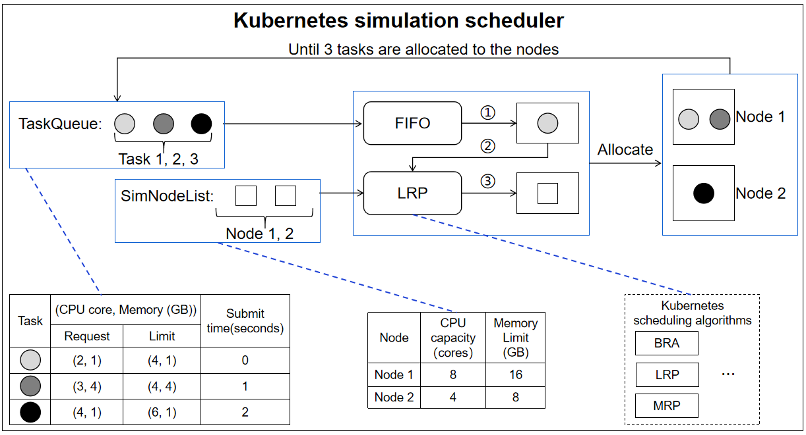
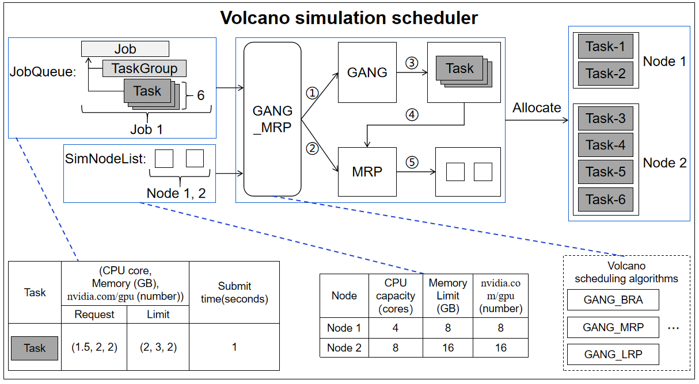

# K8sSim(A Kubernetes cluster simualtor)


## Table of contents
- [K8sSim](#k8ssim)
  - [Table of contents](#table-of-contents)
  - [1. Introduction](#1-introduction)
  - [2. K8sSim framework](#2-k8ssim-framework)
    - [2.1 Kubernetes Simualtion](#11-kubernetes-simulation)
      - [2.1.1 k8s-simulator-prop](#111-k8s-simulator-prop)
      - [2.1.2 k8s-benchmark](#112-k8s-benchmark)
      - [2.1.3 Get-started](#113-get-started)
    - [2.2 Volcano Simulation](#12-volcano-simulation)
      - [2.2.1 Volcano_simulator](#121-volcano_simulator)
      - [2.2.2 Submit_volcano_workloads](#122-submit_volcano_workloads)
      - [2.2.3 Get-started](#123-get-started)
  - [3. Contact information](#2-contact-information)
  
# 1. Introduction
We propose a cluster simulator called K8sSim, a simulation tool for Kubernetes schedulers and its applications in scheduling algorithm optimization. Then we design and implement K8sSim, which incorporates typical Kubernetes and Volcano scheduling algorithms for both generic and AI workloads, and provides an accurate simulation of their scheduling process in real clusters. As a result, K8sSim can not only ensure the accuracy of scheduling results, but also greatly accelerate the scheduling time of different scheduling algorithms in the real cluster. Therefore, our proposed K8sSim can provide a convenient analysis tool and a basis for a series of research works on cluster scheduling optimization.

# 2. K8sSim framework

## 2.1 Kubernetes Simualtion
It is responsible for the scheduling of ***generic workloads*** in Kubernetes simulation scheduler (For a generic workload, tasks in a job are submitted to excute sequentially)


### 2.1.1 k8s-simulator-prop：Kubernetes simualtion scheduler
* k8s/example: ***the startup program of Kubernetes simualtion scheduler*** 
  * conf.go: port is used to specify the execution port of the simulation scheduler, **e.g. port = ":8002"**
  * create_scheduler.go: create a new generic scheduler that mimics a kube-scheduler
  
  ```go

  func buildSchedulers() []scheduler.Scheduler {

	// 1. Create a generic scheduler that mimics a kube-scheduler.
	sched1 := scheduler.NewGenericScheduler( /* preemption enabled */ true)
	sched2 := scheduler.NewGenericScheduler( /* preemption enabled */ true)
	sched3 := scheduler.NewGenericScheduler( /* preemption enabled */ true)
	sched4 := scheduler.NewGenericScheduler( /* preemption enabled */ true)
	sched5 := scheduler.NewGenericScheduler( /* preemption enabled */ true)
	sched6 := scheduler.NewGenericScheduler( /* preemption enabled */ true)
	sched7 := scheduler.NewGenericScheduler( /* preemption enabled */ true)
	sched8 := scheduler.NewGenericScheduler( /* preemption enabled */ true)
	sched9 := scheduler.NewGenericScheduler( /* preemption enabled */ true)
	sched10 := scheduler.NewGenericScheduler( /* preemption enabled */ true)
	sched11 := scheduler.NewGenericScheduler( /* preemption enabled */ true)

	scheds := make([]scheduler.Scheduler, 12, 12)
	scheds[1] = &sched1
	scheds[2] = &sched2
	scheds[3] = &sched3
	scheds[4] = &sched4
	scheds[5] = &sched5
	scheds[6] = &sched6
	scheds[7] = &sched7
	scheds[8] = &sched8
	scheds[9] = &sched9
	scheds[10] = &sched10
	scheds[11] = &sched11

	// 2. Register plugin(s)
	// Predicate
	sched1.AddPredicate("GeneralPredicates", predicates.GeneralPredicates)
	sched2.AddPredicate("GeneralPredicates", predicates.GeneralPredicates)
	sched3.AddPredicate("GeneralPredicates", predicates.GeneralPredicates)
	sched4.AddPredicate("GeneralPredicates", predicates.GeneralPredicates)
	sched5.AddPredicate("GeneralPredicates", predicates.GeneralPredicates)
	sched6.AddPredicate("GeneralPredicates", predicates.GeneralPredicates)
	sched7.AddPredicate("GeneralPredicates", predicates.GeneralPredicates)
	sched8.AddPredicate("GeneralPredicates", predicates.GeneralPredicates)
	sched9.AddPredicate("GeneralPredicates", predicates.GeneralPredicates)
	sched10.AddPredicate("GeneralPredicates", predicates.GeneralPredicates)
	sched11.AddPredicate("GeneralPredicates", predicates.GeneralPredicates)

	sched2.AddPrioritizer(priorities.PriorityConfig{
		Name:   "LeastRequested",
		Map:    priorities.LeastRequestedPriorityMap,
		Reduce: nil,
		Weight: 1,
	})

	sched3.AddPrioritizer(priorities.PriorityConfig{
		Name:   "MostRequested",
		Map:    priorities.MostRequestedPriorityMap,
		Reduce: nil,
		Weight: 1,
	})

	sched4.AddPrioritizer(priorities.PriorityConfig{
		Name:   "BalancedResourceAllocation",
		Map:    priorities.BalancedResourceAllocationMap,
		Reduce: nil,
		Weight: 1,
	})

	sched5.AddPrioritizer(priorities.PriorityConfig{
		Name:   "ResourceLimitsPriority",
		Map:    priorities.ResourceLimitsPriorityMap,
		Reduce: nil,
		Weight: 1,
	})

	sched6.AddPrioritizer(priorities.PriorityConfig{
		Name:   "TaintTolerationPriority",
		Map:    priorities.ComputeTaintTolerationPriorityMap,
		Reduce: nil,
		Weight: 1,
	})

	sched7.AddPrioritizer(priorities.PriorityConfig{
		Name:   "NodeAffinityPriority",
		Map:    priorities.CalculateNodeAffinityPriorityMap,
		Reduce: nil,
		Weight: 1,
	})

	sched8.AddPrioritizer(priorities.PriorityConfig{
		Name:   "NodePreferAvoidPodsPriority",
		Map:    priorities.CalculateNodePreferAvoidPodsPriorityMap,
		Reduce: nil,
		Weight: 1,
	})

	sched9.AddPrioritizer(priorities.PriorityConfig{
		Name:   "ImageLocalityPriority",
		Map:    priorities.ImageLocalityPriorityMap,
		Reduce: nil,
		Weight: 1,
	})

	sched10.AddPrioritizer(priorities.PriorityConfig{
		Name:   "NodeLabelPriority",
		Map:    new(priorities.NodeLabelPrioritizer).CalculateNodeLabelPriorityMap,
		Reduce: nil,
		Weight: 1,
	})

	sched11.AddPrioritizer(priorities.PriorityConfig{
		Name:   "InterPodAffinityPriority",
		Map:    nil,
		Reduce: nil,
		Function: new(priorities.InterPodAffinity).CalculateInterPodAffinityPriority,
		Weight: 1,
	})

	return scheds
  }
  ```

### 2.1.2 k8s-benchmark：Simulation environment
* common/test_workloads: some generic workloads to test (user-submitted workloads, e.g. ce/ce-bra.yaml)
* common/nodes: some configuration files of node resources (simulation nodes, c2e2.yaml)
* common/summarizing: some formatted codes for the scheduling results of jobs and tasks, which is easy to analyze and use visually
* run_sim_workload.py: ***the startup program used to submit the workload and node configuration*** 
  * workload_dir: specifying the folder where the test workload is located
  * sim_node_conf: specifying the simulation nodes for this test
  * schedulers: specifying the names of the multiple Kubernetes scheduling algorithms to be run (e.g. bra, lrp, mrp)
  * repeat_times: number of repeated runs
  * sim_base_url: the port on which the simulation scheduler will run (**e.g. 'http://localhost:8002'**)
  * result_dir: the location where the simulation results will be saved

### 2.1.3 Get Started
* Requirements:
  * Linux and Windows
  * Python 3.8
  * Go 1.14.13
* How to start:
  * *1. cd Kubernetes Simulation/k8s-simulator-prop*
  * *2. cd k8s/example*
  * *3. go bulid*
  * *4. example.exe (Windows system); ./example/example port (Linux system)*
  * *5. cd Kubernetes Simulation/k8s-benchmark*
  * *6. python3.8 run_sim_workload.py*

## 2.2 Volcano Simulation
It is responsible for the scheduling of ***AI workloads*** in Volcano simulation scheduler (For a AI workload, tasks in a job are executed concurrently by task-group)


### 2.2.1 Volcano_simulator：Volcano simualtion scheduler
* cmd/sim: ***the startup program of Volcano simualtion scheduler*** 
  * conf.go: port is used to specify the execution port of the simulation scheduler, **e.g. var port = ":8006"**
  * pkg/scheduler/scheduler.go: function NewScheduler returns a new scheduler, and function loadSchedulerConf loads a new scheduler configuration
  
  ```go
  
  func NewScheduler(
	config *rest.Config,
	schedulerName string,
	schedulerConf string,
	period time.Duration,
	defaultQueue string,
	nodeSelectors []string,
   ) (*Scheduler, error) {
	var watcher filewatcher.FileWatcher
	if schedulerConf != "" {
		var err error
		path := filepath.Dir(schedulerConf)
		watcher, err = filewatcher.NewFileWatcher(path)
		if err != nil {
			return nil, fmt.Errorf("failed creating filewatcher for %s: %v", schedulerConf, err)
		}
	}

	scheduler := &Scheduler{
		schedulerConf:  schedulerConf,
		fileWatcher:    watcher,
		cache:          schedcache.New(config, schedulerName, defaultQueue, nodeSelectors),
		schedulePeriod: period,
	}

	return scheduler, nil
   }
   ```
   
   ```go
   func (pc *Scheduler) loadSchedulerConf() {
	var err error
	pc.once.Do(func() {
		pc.actions, pc.plugins, pc.configurations, err = unmarshalSchedulerConf(defaultSchedulerConf)
		if err != nil {
			klog.Errorf("unmarshal scheduler config %s failed: %v", defaultSchedulerConf, err)
			panic("invalid default configuration")
		}
	})

	var config string
	if len(pc.schedulerConf) != 0 {
		if config, err = readSchedulerConf(pc.schedulerConf); err != nil {
			klog.Errorf("Failed to read scheduler configuration '%s', using previous configuration: %v",
				pc.schedulerConf, err)
			return
		}
	}

	actions, plugins, configurations, err := unmarshalSchedulerConf(config)
	if err != nil {
		klog.Errorf("scheduler config %s is invalid: %v", config, err)
		return
	}

	pc.mutex.Lock()
	// If it is valid, use the new configuration
	pc.actions = actions
	pc.plugins = plugins
	pc.configurations = configurations
	pc.mutex.Unlock()
   }
   ```
     
### 2.2.2 Submit_volcano_workloads：Simulation environment
* common/workloads: some AI workloads to test (user-submitted workloads, e.g. AI-workloads/wsl_test_mrp-2.yaml)
* common/nodes: some configuration files of node resources (simulation nodes, nodes_7-0.yaml)
* SimRun.py: ***the startup program used to submit the workload and node configuration*** 
  * sim_base_url: the port on which the simulation scheduler will run (**e.g. 'http://localhost:8006'**)
  * node_file_url: specifying the simulation nodes for this test
  * workload_file_url: specifying the folder where the test workload is located
  * schedulers: specifying the names of the multiple Volcano scheduling algorithms to be run (e.g. GANG_BRA, GANG_MRP, GANG_LRP)
  * pods_result_url: the location where the pods' simulation results will be saved
  * jobs_result_url: the location where the jobs' simulation results will be saved
  * figures_result_url: the location where the result figures will be saved

### 2.2.3 Get Started
* Requirements:
  * Linux and Windows
  * Python 3.8
  * Go 1.17.6
* How to start:
  * *1. cd Volcano Simulation/Volcano_simulator*
  * *2. cd cmd/sim*
  * *3. go bulid*
  * *4. sim.exe (Windows system); ./sim/sim port (Linux system)*
  * *5. cd Volcano Simulation/Submit_volcano_workloads*
  * *6. python3.8 SimRun.py*

# 3. Contact information
## Beijing Institute of Technology
Shilin Wen, Rui Han, Ke Qiu, Xiaoxin Ma, Zeqing Li, Hongjie Deng, and Chi Harold Liu
## E-mail
Shilin Wen: 3120185530@bit.edu.cn
## Version
This project version is K8sSim v1.0.

